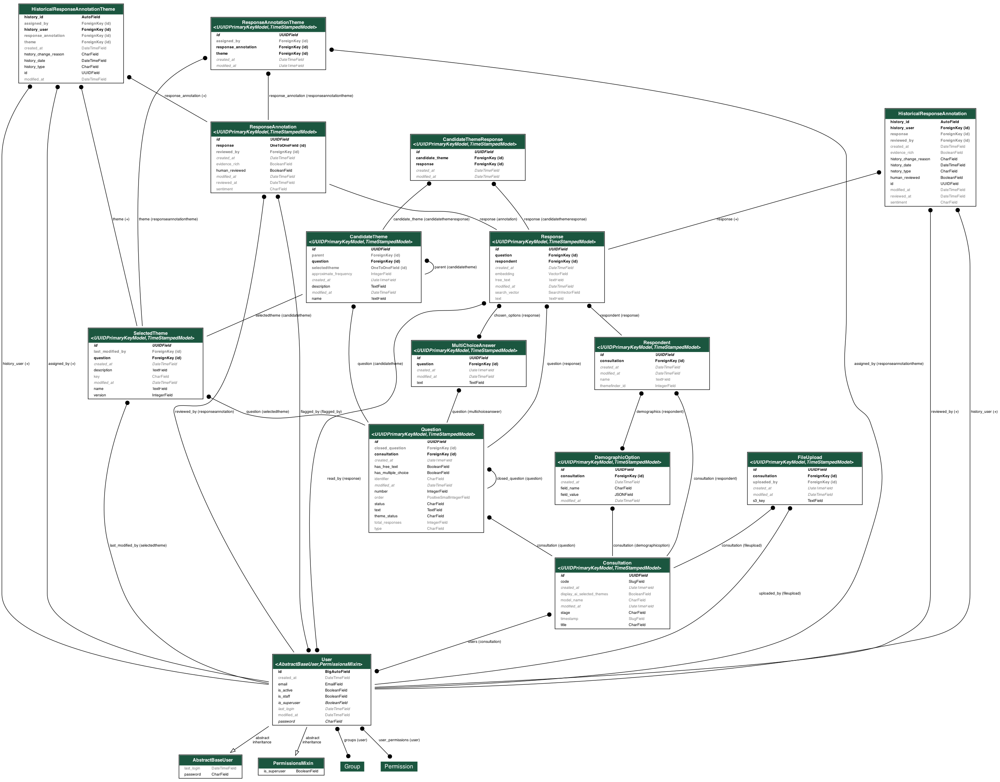

# Consultation Analyser

This project is currently at prototyping stage.

The Consultation Analyser is an AI-powered tool to automate the processing of public consultations.

## Setting up the application

Populate `.env` by copying `.env.example` and filling in required values.

Ensure you have `python > 3.10` and `poetry` installed.

```
poetry install
```

### Database

Assuming local postgres:

```
# dev
make setup_dev_db

# test
make setup_test_db
```

Confirm it works with

```
make check_db
```

(You can see all the available `make` commands by running bare `make` or `make help`).

### Generating dummy data

Only run this in development. Will create a consultation with 10 complete responses in a variety of question formats.

```
make dummy_data
```

### Database migrations and schema diagram

If you use the `make migrate` command to run migrations, the diagram below will
be regenerated automatically. If you need to generate it outside that process,
you can run `manage.py generate_erd`. (You will need `graphviz` installed: see
[`pydot` docs](https://pypi.org/project/pydot/)).



### Frontend


#### CSS

We depend on `govuk-frontend` for GOV.UK Design System styles.

```
npm install
```

Once this has been done, `django-compressor` should work automatically to
compile the govuk-frontend SCSS on the first request and any subsequent request
after the SCSS has changed. In the meantime it will read from `frontend/CACHE`,
which is `.gitignore`d.

When we get to production, we can prepopulate `frontend/CACHE` using `manage.py
compress` before building our container, which will mean that every request
will be served from the cache.

`django-compressor` also takes care of fingerprinting and setting cache headers
for our CSS so it can be cached.

#### Fonts and images

The govuk assets are versioned in the `npm` package. On initial app setup you will need to run `make govuk_frontend` to copy them to the `frontend` folder from where `runserver` can serve them.

We’ll revisit this process when we deploy the app.

### Run the application

```
make serve
```

### Run the tests

```
make test
```

## Frontend Prototype

Located at `/prototype`. Using the Gov.uk Prototype Kit. This is work in progress, not all pages are available yet.

### How to run

Ensure you have a recent version of Node.js installed (v16 or greater). Then, from the prototype directory, run:
`npm install`

To start development server:
`npm run dev`

Start at http://localhost:3000/
