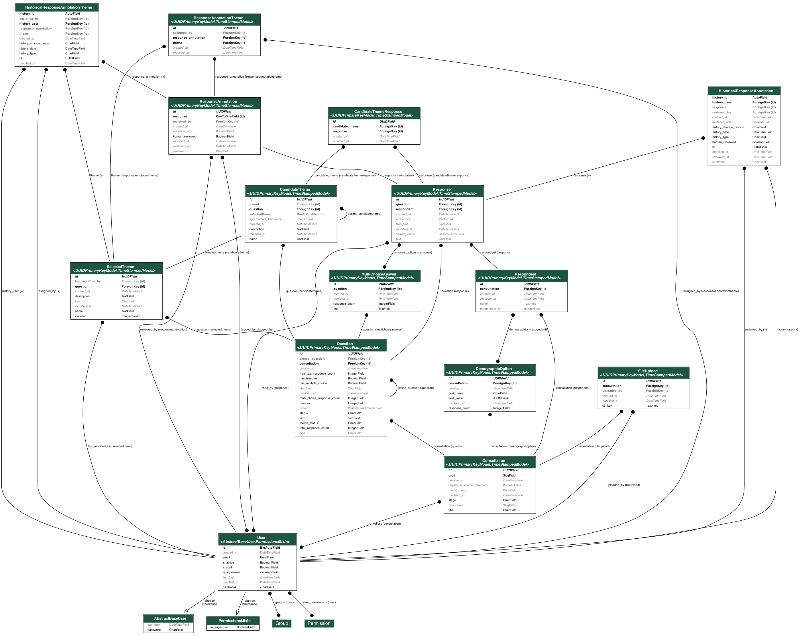

# Consult

Consult is a web application that combines AI with human oversight to process public consultation responses at scale to inform public policy. Once consultation responses are uploaded to the app, the AI identifies themes across the responses using the [themefinder](https://pypi.org/project/themefinder/) package. Users review and finalise these themes — selecting, editing, or creating new ones — before AI assigns the finalised themes to individual responses. The results are presented in a dashboard for users to analyse and draw insights from.

The repository is split into a Django REST backend (`backend/`), an Astro and Svelte frontend (`frontend/`), AI processing pipelines that run on AWS Batch (`pipeline-sign-off/`, `pipeline-mapping/`), Lambda functions that sync pipeline results to the database (`lambda/`), and Terraform infrastructure (`terraform/`).

> [!IMPORTANT]
> Incubation Project: This project is an incubation project; as such, we don't recommend using this for critical use cases yet. We are currently in a research stage, trialling the tool for case studies across the Civil Service. If you are a civil servant and wish to take part in our research stage, please contact us at i-dot-ai-enquiries@cabinetoffice.gov.uk.

## Setting up the application

### External dependencies

Installation instructions assume using a Mac with Homebrew.

- [Docker Desktop](https://docs.docker.com/desktop/install/mac-install/)
- uv ([instructions](https://docs.astral.sh/uv/getting-started/installation/))
- nvm ([instructions](https://github.com/nvm-sh/nvm?tab=readme-ov-file#install--update-script))
- GraphViz (`brew install graphviz`), used for generating database diagrams
- pre-commit (`brew install pre-commit`)

### Clone and install

```
git clone git@github.com:i-dot-ai/consult.git
cd consult
make install
make setup
```

The `make install` command installs the correct Python and Node versions and all dependencies. And `make setup` creates `.env` files from templates and sets up the database with dummy data and an admin user (`email@example.com` / `admin`).

### Running the application

```
make serve
```

This starts the backend (API server + RQ workers) at `http://localhost:8000` and the frontend (Astro dev server) at `http://localhost:3000`.

You can also run them separately with `make backend` and `make frontend`.

## Developing the application

### Database migrations

To generate new migrations after changing models:

```
make migrations
```

To apply migrations:

```
make migrate
```

Running `make migrate` also regenerates the entity-relationship diagram at `docs/erd.png` (requires `graphviz`). The current schema:



### Tests

Run backend tests:

```
make test-backend
```

Run frontend tests:

```
make test-frontend
```

Run end-to-end tests:

```
make test-end-to-end
```

### VSCode setup (recommended)

This project includes VSCode configuration files to ensure consistent development experience:

- `.vscode/settings.json` - Workspace settings for formatting, linting, and language support
- `.vscode/extensions.json` - Recommended extensions for the project

When you open the project in VSCode, you'll be prompted to install recommended extensions. These include:

- **Python** - Python language support with uv integration
- **Ruff** - Python linter and formatter
- **ESLint** - JavaScript/TypeScript linter
- **Prettier** - JavaScript/TypeScript code formatter
- **Astro** - Astro framework support
- **Svelte** - Svelte framework support
- **Tailwind CSS IntelliSense** - Tailwind CSS tooling

The workspace settings are configured to:

- Format code on save (using appropriate formatter per language)
- Auto-fix ESLint issues on save
- Enable TypeScript support in Svelte files

You can override these settings in your User Settings if you prefer different personal configurations. See the [VSCode settings documentation](https://code.visualstudio.com/docs/getstarted/settings) for more information on the settings hierarchy.
