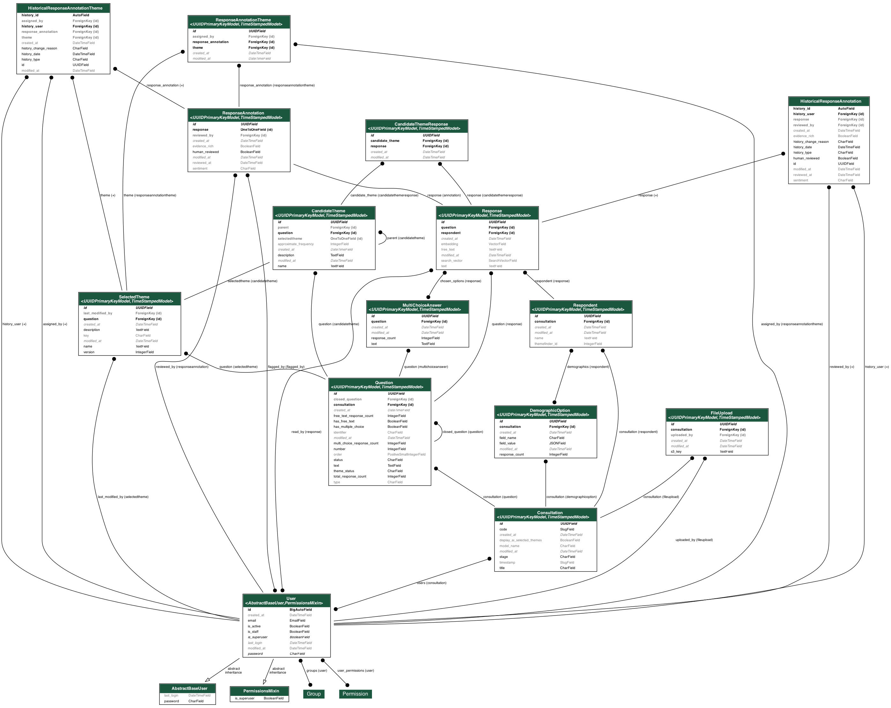

# Consult

Consult is a web application that combines AI with human oversight to process public consultation responses at scale to inform public policy. Once consultation responses are uploaded to the app, the AI identifies themes across the responses using the [themefinder](https://pypi.org/project/themefinder/) package. Users review and finalise these themes — selecting, editing, or creating new ones — before AI assigns the finalised themes to individual responses. The results are presented in a dashboard for users to analyse and draw insights from.

The repository is split into a Django REST backend (`backend/`), an Astro and Svelte frontend (`frontend/`), AI processing pipelines that run on AWS Batch (`pipeline-sign-off/`, `pipeline-mapping/`), Lambda functions that sync pipeline results to the database (`lambda/`), and Terraform infrastructure ([`terraform/`](terraform/README.md)).

> [!IMPORTANT]
> Incubation Project: This project is an incubation project; as such, we don't recommend using this for critical use cases yet. We are currently in a research stage, trialling the tool for case studies across the Civil Service. If you are a civil servant and wish to take part in our research stage, please contact us at i-dot-ai-enquiries@cabinetoffice.gov.uk.

## Setting up the application

### External dependencies

Installation instructions assume using a Mac with Homebrew.

- [Docker Desktop](https://docs.docker.com/desktop/install/mac-install/)
- uv ([instructions](https://docs.astral.sh/uv/getting-started/installation/))
- nvm ([instructions](https://github.com/nvm-sh/nvm?tab=readme-ov-file#install--update-script))
- GraphViz (`brew install graphviz`), used for generating database diagrams
- pre-commit (`brew install pre-commit`)
- Postegres(optional) (`brew install postgresql`) if you are getting `psycopg2` error during `make setup`

We use a 14-day cooldown on package installations to maintain security, these can be found in:

- .github/dependabot.yml
- frontend/.npmrc
- e2e_tests/.npmrc
- backend/pyproject.toml

### Prerequisites for running end-to-end tests

Make sure that you have `coreutils` installed:
`brew install coreutils`

Also note that you will need to add a personal access token on github with `read:packages` access and then use this to log in on the command line before running the end-to-end tests:
```
echo $PASSWORD | docker login ghcr.io -u <username> --password-stdin
```

### Clone and install

```
git clone git@github.com:i-dot-ai/consult.git
cd consult
make install
make setup
```

The `make install` command installs the correct Python and Node versions and all dependencies. And `make setup` creates `.env` files from templates and sets up the database with dummy data and an admin user (`email@example.com` / `admin`).

### Running the application

```
make serve
```

This starts the backend (API server + RQ workers) at `http://localhost:8000` and the frontend (Astro dev server) at `http://localhost:3000`.

You can also run them separately with `make backend` and `make frontend`.

## Developing the application

### Database migrations

To generate new migrations after changing models:

```
make migrations
```

To apply migrations:

```
make migrate
```

Running `make migrate` also regenerates the entity-relationship diagram at `docs/erd.png` (requires `graphviz`). The current schema:



### Tests

Run backend tests:

```
make test-backend
```

Run frontend tests:

```
make test-frontend
```

Run end-to-end tests:

```
docker compose up -d postgres # postgres must be running already
make test-end-to-end
```
If you are getting error while running e2e that the frontend is failing to start during the docker spin up its likely because of the timeout module that is missing and you will need to run

```shell
brew install coreutils
```

### Setting up a new consultation

The `scripts/` directory contains CLI tools for preparing a consultation's
data for the ThemeFinder pipeline:

```bash
# Generate an opinionated Q.U. workbook template with live in-sheet validation:
make build-consultation-template

# Validate a Q.U. workbook against response data, build the ThemeFinder
# input layout, and upload it to S3:
make setup-consultation name=my_consultation
```

See [`scripts/README.md`](scripts/README.md) for the full pipeline
walkthrough and [`scripts/setup_consultation_checks.md`](scripts/setup_consultation_checks.md)
for the list of validation rules.

### VSCode setup (recommended)

This project includes VSCode configuration files to ensure consistent development experience:

- `.vscode/settings.json` - Workspace settings for formatting, linting, and language support
- `.vscode/extensions.json` - Recommended extensions for the project

When you open the project in VSCode, you'll be prompted to install recommended extensions. These include:

- **Python** - Python language support with uv integration
- **Ruff** - Python linter and formatter
- **ESLint** - JavaScript/TypeScript linter
- **Prettier** - JavaScript/TypeScript code formatter
- **Astro** - Astro framework support
- **Svelte** - Svelte framework support
- **Tailwind CSS IntelliSense** - Tailwind CSS tooling

The workspace settings are configured to:

- Format code on save (using appropriate formatter per language)
- Auto-fix ESLint issues on save
- Enable TypeScript support in Svelte files

You can override these settings in your User Settings if you prefer different personal configurations. See the [VSCode settings documentation](https://code.visualstudio.com/docs/getstarted/settings) for more information on the settings hierarchy.

### Running Evals

Run one component through the shared evaluation framework from `themefinder/evals/`:

```bash
uv run --extra eval python run_eval.py --component generation --dataset gambling_XS
```

Use `make run-evals` for the quick multi-component benchmark or `make run-eval EVAL_TYPE=mapping`
for one benchmark component.

### Configuring Certificates

When you run the backend or eval pipeline, you may encounter certificate errors such as:
```python
httpx.ConnectError: [SSL: CERTIFICATE_VERIFY_FAILED] certificate verify failed: unable to get local issuer certificate
```
This indicates that you don't have the correct certificate for your VPN, or that python isn't reading it correctly.

To solve this issue, follow these steps:

1. Generate the chain of certificates for the URL that you are trying to access:
    ```bash
    openssl s_client -connect "YOUR_URL:443" -servername "YOUR_URL" -showcerts </dev/null 2>/dev/null >/tmp/cert_chain.txt
    ```

2. Split the chain into individual files, one per certificate:
    ```bash
    awk '
    /-----BEGIN CERTIFICATE-----/ {
    file=sprintf("/tmp/cert_%d.pem", n++)
    in_cert=1
    }
    in_cert {
    print > file
    }
    /-----END CERTIFICATE-----/ {
    close(file)
    in_cert=0
    }
    ' /tmp/cert_chain.txt
    ```

3. Knit all certificates apart from the first one (the leaf certificate) into a single pem bundle:
    ```bash
    cert_files=(/tmp/cert_*.pem)
    filtered_cert_files=()

    for cert_file in "${cert_files[@]}"; do
    if [ "$cert_file" != "/tmp/cert_0.pem" ]; then
        filtered_cert_files+=("$cert_file")
    fi
    done

    if [ ${#filtered_cert_files[@]} -eq 0 ]; then
    printf 'No certificate files matching cert_*.pem were found after excluding cert_0.pem.\n' >&2
    exit 1
    fi

    printf '%s\n' "${filtered_cert_files[@]}" | sort -V | xargs cat -- > /tmp/cert_bundle.pem

    printf 'Created /tmp/cert_bundle.pem from %s certificate file(s), excluding /tmp/cert_0.pem.\n' "${#filtered_cert_files[@]}"
    ```
    After generating the `cert_bundle.pem` file, you may wish to move it somewhere safer.

4. Set the `SSL_CERT_FILE` parameter in the `.env` file to the location of your `cert_bundle.pem` file.

5. Check that the `pip-system-certs` module is installed
    ```bash
    uv pip show pip-system-certs
    ```
    If this prints the details of the module, it's installed. If not, install it with `uv add pip-system-certs`.
