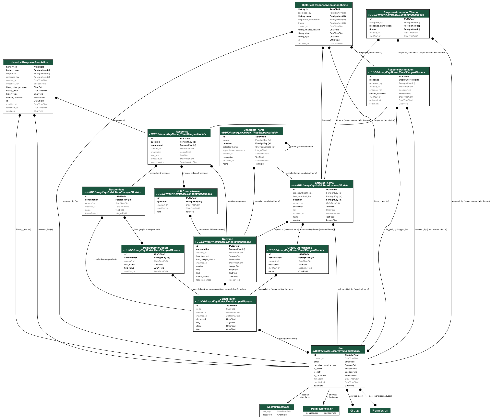

# Consult

Consult is a web application that combines AI with human oversight to process public consultation responses at scale to inform public policy. Once consultation responses are uploaded to the app, the AI identifies themes across the responses using the [themefinder](https://pypi.org/project/themefinder/) package. Users review and finalise these themes — selecting, editing, or creating new ones — before AI assigns the finalised themes to individual responses. The results are presented in a dashboard for users to analyse and draw insights from.

The repository is split into a Django REST backend (`backend/`), an Astro and Svelte frontend (`frontend/`), AI processing pipelines that run on AWS Batch (`pipeline-sign-off/`, `pipeline-mapping/`), Lambda functions that sync pipeline results to the database (`lambda/`), and Terraform infrastructure (`terraform/`).

> [!IMPORTANT]
> Incubation Project: This project is an incubation project; as such, we don't recommend using this for critical use cases yet. We are currently in a research stage, trialling the tool for case studies across the Civil Service. If you are a civil servant and wish to take part in our research stage, please contact us at i-dot-ai-enquiries@cabinetoffice.gov.uk.

## Setting up the application

### External dependencies

- pre-commit (`brew install pre-commit`)

Installation instructions assume using a Mac with Homebrew.

### Clone the repo

```
git clone git@github.com:i-dot-ai/consult.git
```

In the new repo install pre-commit:

```
cd consult
```

```
pre-commit install
```

Pre-commit identifies some potential secrets on commit (but will not catch all potential sensitive information).

### Setting up the backend

#### Dependencies

- [Docker Desktop](https://docs.docker.com/desktop/install/mac-install/)
- GraphViz (`brew install graphviz`), used for generating database diagrams
- pyenv ([instructions](https://github.com/pyenv/pyenv?tab=readme-ov-file#installation))
- poetry ([instructions](https://python-poetry.org/docs/#installation))

#### Installation

1. Install the correct Python version by running `pyenv install`
2. Install dependencies with `cd backend && poetry install`
3. Populate `.env` by copying `.env.test`

#### Database setup

1. Start PostgreSQL locally with `docker compose up -d postgres`
2. Run `make dev_environment` to set up dev and test databases with dummy data. This will reset the database, apply migrations, generate dummy data, and create an admin user with the username `email@example.com`.
3. Confirm everything is working with `make check_db`

(You can see all the available `make` commands by running bare `make` or `make help`).

### Setting up the frontend

1. Install nvm ([instructions](https://github.com/nvm-sh/nvm?tab=readme-ov-file#install--update-script))
2. Use the correct Node version by running `nvm install` and `nvm use`
3. Install dependencies with `npm install`
4. Create `frontend/.env` and copy contents of `frontend/.env.example`

## Running the application

Start the backend:

```
make backend
```

This starts the API server and RQ workers via honcho. The backend will be available at `http://localhost:8000`.

Start the frontend:

```
make frontend
```

This starts the Astro dev server. The frontend will be available at `http://localhost:3000`.

## Developing the application

### Database migrations

To generate new migrations after changing models:

```
make migrations
```

To apply migrations:

```
make migrate
```

Running `make migrate` also regenerates the entity-relationship diagram at `docs/erd.png` (requires `graphviz`). The current schema:



### Tests

Run backend tests:

```
make test-backend
```

Run frontend tests:

```
make test-frontend
```

Run end-to-end tests:

```
make test-end-to-end
```

### VSCode setup (recommended)

This project includes VSCode configuration files to ensure consistent development experience:

- `.vscode/settings.json` - Workspace settings for formatting, linting, and language support
- `.vscode/extensions.json` - Recommended extensions for the project

When you open the project in VSCode, you'll be prompted to install recommended extensions. These include:

- **Python** - Python language support with Poetry integration
- **Ruff** - Python linter and formatter
- **ESLint** - JavaScript/TypeScript linter
- **Prettier** - JavaScript/TypeScript code formatter
- **Astro** - Astro framework support
- **Svelte** - Svelte framework support
- **Tailwind CSS IntelliSense** - Tailwind CSS tooling

The workspace settings are configured to:

- Format code on save (using appropriate formatter per language)
- Auto-fix ESLint issues on save
- Enable TypeScript support in Svelte files

You can override these settings in your User Settings if you prefer different personal configurations. See the [VSCode settings documentation](https://code.visualstudio.com/docs/getstarted/settings) for more information on the settings hierarchy.
