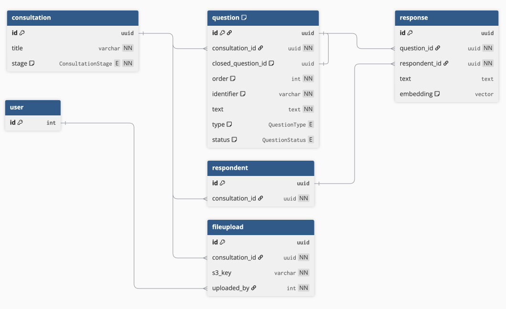

# 6. Database redesign for self-serve data setup

Date: 2026-02-18

## Status

Accepted

## Context

We are building a self-serve data setup journey so that users can upload their consultation data, configure questions, clean data and prepare their consultation for analysis. The current database schema does not support this.


_Current database schema on [dbdiagram](https://dbdiagram.io/d/Data-Setup-Current-698e0481bd82f5fce28e7725)_

We need a way to:

- Record what data files were uploaded and when for auditability
- Represent initial consultation data after a data file has been uploaded and before setup is complete. In this state, users have not yet defined the question types and that determines where we store the responses (`response` for open question responses, `demographicoption` and `respondent_demographics` for demographic question responses, `multichoiceanswer` and `response_chosen_options` for closed question responses)
- Represent progress through the data setup journey so users can pick up where they left off
- Separate hybrid questions (questions with `has_free_text` and `has_multiple_choice`) so that any closed question can be used to filter the responses of any open question
- Maintain a one-to-one relationship of closely related closed and open questions (such as, "Do you agree with X?" and "Why?") so we can display them alongside each other in the analysis dashboard

## Decision

We will restructure the database to address each of these needs.



_Proposed database schema on [dbdiagram](https://dbdiagram.io/d/Data-Setup-New-699348d0bd82f5fce2db8240)_

A new `fileupload` table stores a reference to the original file in S3 alongside the consultation and the user who uploaded it.

All response data is stored in a single `text` field on the `response` table, regardless of question type, with the related `question.type` representing whether its a demographic, open or closed question.

Multi-select closed questions (e.g., "What are your favourite ice-cream flavours?") are represented as separate responses per chosen option (e.g., one response for "Chocolate" and another for "Vanilla" for the same respondent).

The `question.status` tracks each question through its lifecycle (`draft` → `configured` → `finalising_themes` → `confirmed_themes`) so that we can track progress through data setup.

Closely related closed and open questions are represented by a `closed_question_id` on the open question.

## Consequences

Denormalising responses means we'll be able to remove four tables and significantly reduce complexity which is a huge improvement for maintainability and extensibility.

There is a small hit on performance for data cleaning (see appendix) but this is an acceptable tradeoff given it's a one-off action during data setup, not a repeated query.

Denormalising also moves the responsibility of data consistency from the database to the application because we can no longer rely on referential integrity to guarantee every closed question response points to a valid answer option. This is preferred because we want to give users the flexibility of defining the valid options for a closed question and performing these updates is simpler if we have just one table to update.

Denormalising increases the number of rows in the `response` table since demographic and closed question responses are now stored alongside open question responses. However, the storage overhead is negligible: `response.embedding` is nullable and PostgreSQL uses a null bitmap for nullable columns, so a NULL embedding costs just 1 bit per row rather than the ~12KB allocated for non-NULL embeddings (3072-dimension vector).

We will need to migrate our existing data to fit this new schema which will be the trickiest for hybrid questions where we will have to define a question title (`question.text`) for both the open and closed part such that the list of questions and filtering in the analysis dashboard is still intuitive to users.

## Appendix

In order to assess the performance impact of denormalising responses, I setup a consultation locally with 10 million rows (500,000 respondents x 20 questions) and benchmarked the database queries.

| Query                                                      | Execution time |
| ---------------------------------------------------------- | -------------- |
| Count response frequency for a closed question             | 68ms           |
| Filter open question responses by 3 closed question values | 218ms          |
| Update all closed question responses (~167K rows)          | 3.9s           |

These are conservative benchmarks. The vast majority of consultations will have much fewer respondents (30,000 or less) and the performance of database queries should be faster in production using AWS RDS.

<details>
<summary>Code to set up data for benchmarking</summary>

```sql
-- Create test table
CREATE TABLE bench_response (
    id uuid DEFAULT gen_random_uuid() PRIMARY KEY,
    question_id uuid NOT NULL,
    respondent_id uuid NOT NULL,
    text text
);

-- Generate 5 closed questions, 15 open questions
CREATE TEMP TABLE bench_questions AS
SELECT gen_random_uuid() AS id, q_num,
       CASE WHEN q_num <= 5 THEN 'closed' ELSE 'open' END AS type
FROM generate_series(1, 20) AS q_num;

-- Generate 500,000 respondents
CREATE TEMP TABLE bench_respondents AS
SELECT gen_random_uuid() AS id
FROM generate_series(1, 500000);

-- Insert 10 million responses
INSERT INTO bench_response (question_id, respondent_id, text)
SELECT
    q.id,
    r.id,
    CASE
        WHEN q.q_num = 1 THEN (ARRAY['Individual','Organisation','Business','Other'])[floor(random()*4+1)::int]
        WHEN q.q_num = 2 THEN (ARRAY['England','Scotland','Wales','Northern Ireland'])[floor(random()*4+1)::int]
        WHEN q.q_num = 3 THEN (ARRAY['Yes','No','Not sure'])[floor(random()*3+1)::int]
        WHEN q.q_num = 4 THEN (ARRAY['Agree','Disagree','Neutral'])[floor(random()*3+1)::int]
        WHEN q.q_num = 5 THEN (ARRAY['18-24','25-34','35-44','45-54','55+'])[floor(random()*5+1)::int]
        ELSE 'This is a free text response about the consultation topic.'
    END
FROM bench_questions q
CROSS JOIN bench_respondents r;

-- Add the composite index
CREATE INDEX idx_bench_question_text_respondent
ON bench_response (question_id, text, respondent_id);

ANALYZE bench_response;
```

</details>

<details>
<summary>Benchmark queries</summary>

```sql
EXPLAIN ANALYZE
SELECT text, count(*)
FROM bench_response
WHERE question_id = '8b447dc7-0186-43c2-999f-fc6b34050c3f'
GROUP BY text;

EXPLAIN ANALYZE
SELECT r.id, r.text
FROM bench_response r
JOIN bench_response f1 ON r.respondent_id = f1.respondent_id
AND f1.question_id = '8b447dc7-0186-43c2-999f-fc6b34050c3f' AND f1.text = 'Individual'
JOIN bench_response f2 ON r.respondent_id = f2.respondent_id
AND f2.question_id = '636b8812-0b17-4dbc-bfb7-1542016cac89' AND f2.text IN ('England', 'Wales')
JOIN bench_response f3 ON r.respondent_id = f3.respondent_id
AND f3.question_id = '86a73e6b-ed06-441d-87a6-97c755af6acc' AND f3.text = 'Yes'
WHERE r.question_id = '5015e043-2c34-4bee-8dc1-6fd607502ee6';

EXPLAIN ANALYZE
UPDATE bench_response
SET text = 'Yes'
WHERE question_id = '86a73e6b-ed06-441d-87a6-97c755af6acc'
AND text = 'Not sure';
```

</details>
