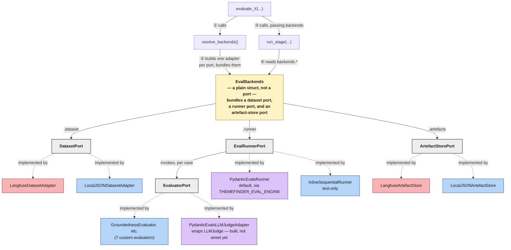

# Modular Evaluation Framework for Themefinder

This is the detailed design behind [ADR-0013](../decisions/0013-modular-evaluation-framework-for-themefinder.md). The ADR
records the decision and its consequences; this document is the reference for how the framework is actually
built — directory layout, types, interfaces, and the rules that keep it swappable in practice, not just in
theory.

Everything here lives under `themefinder/evals/`.

## Problem

`themefinder/evals/` has a working LLM-quality evaluation framework: LLM-judge evaluators, dataset loading,
Langfuse tracing, a multi-model benchmark runner, synthetic data generation. But the execution engine and the
artefact store are hard-wired together. Each of the four stage eval scripts —
`eval_generation.py`, `eval_mapping.py`, `eval_condensation.py`, `eval_refinement.py` — writes its own custom
`_run_with_langfuse(...)` / `_run_local_fallback(...)` branch, duplicating most of its logic across both
paths. Mapping is the one stage where the two paths don't even share scoring logic: its Langfuse path calls
`evaluators.py::mapping_f1_evaluator`, its local fallback calls a separate sklearn-based implementation,
`metrics.py::calculate_mapping_metrics`. Generation, condensation, and refinement are already consistent —
each already calls the same `evaluators.py` LLM-judge functions in both paths. As a direct result, `langfuse`
is a core, non-optional dependency of the package purely to support the duplication.

## Goals

- pydantic-evals is the execution engine: it owns case iteration, concurrency, retries, and reporting.
- Langfuse is dataset + artefact storage only — not the orchestrator.
- Both the engine and the storage backend are genuinely swappable, proven by a test, not just structurally
  possible.
- Zero Langfuse-specific code in the four stage scripts: no import, no type reference, no branding in a
  parameter name.
- Migrate in place, incrementally, with each phase independently revertible.
- DVC drives reproducible eval runs: a `dvc.yaml` pipeline wraps the same entry points every other caller
  uses, giving dependency-aware caching (skip a stage when nothing it depends on changed) and experiment
  tracking (`dvc exp run`/`dvc metrics show`) for comparing intentional variations.

## Non-goals (this pass)

- `benchmark.py` (multi-model runner) keeps calling the four stage functions exactly as it does today, with
  one single-line exception (see [Compatibility contract](#compatibility-contract-with-benchmarkpy)). It is
  not rewritten to call the new ports directly.
- `evals/synthetic/` and its CLI entry point `generate_synthetic.py` (synthetic data generation) are
  untouched. The Langfuse coupling here lives entirely in `generate_synthetic.py`'s own `LangfuseContext`
  construction, trace wrap, and flush — the `evals/synthetic/` package it wraps has no Langfuse references of
  its own.

## One entry point per stage, shared by every caller

Every way an eval actually gets run converges on the same function call:

```
python eval_generation.py --dataset X        ─┐
benchmark.py --evals generation / --quick      ├──▶  evaluate_generation(...)
themefinder-eval.yml (CI, workflow_dispatch)  ─┤            │
dvc.yaml (dvc repro / dvc exp run)            ─┘            ▼
                                              resolve_backends(...) ──▶ run_stage(...)
```

`eval_generation.py`'s `__main__` block calls its own `evaluate_generation` wrapper with the CLI-supplied
dataset — the same function `benchmark.py::EVAL_FUNCS["generation"]` points at, which the
`themefinder-eval.yml` workflow
also reaches (via `benchmark.py --evals "$EVAL_TYPE"` or `--quick`). No caller has its own copy of the
Langfuse-vs-local branching logic. This is the property that makes the framework's swappability real for
every caller, not just for tests: **every `eval_*.py`'s `__main__`/CLI block calls its own module's
`evaluate_X` wrapper, never a lower-level function like `run_stage` directly** — so a CLI run and a
`benchmark.py` run of the same stage are guaranteed to take the identical path through `resolve_backends` and
`run_stage`. `dvc.yaml` (see [Running via DVC](#running-via-dvc) below) is a fourth caller added this pass,
shelling out to the same entry points.

### Adding a new eval stage

Extending the framework to a new stage means adding an evaluator, fixture data, and an `eval_<stage>.py`
entry point in the shape of the existing ones — but the stage's *name* must not be a fact duplicated
independently across `VALID_STAGES`, `EVAL_FUNCS`, the CI workflow's `choices` list, and `params.yaml`, the
way it is today. Those are currently four independent lists of the same stage names with nothing deriving
one from another, so missing an update to one of them means a stage silently works in some entry points and
not others (most commonly: it works locally and via `benchmark.py`, but never appears in the CI dropdown, or
never gets a `dvc repro` stage).

The stage set must instead have a single source of truth that every other list either derives from or is
validated against, so registering a new stage is a one-place change. The exact mechanism for that — a shared
constant the others read, a generation step, a test asserting the lists agree, or something else — is a
decision for implementation time, not this document.

## Architecture overview

Four ports, each an explicit `abc.ABC`, each with a default adapter:

| Port | Role | Default adapter |
|---|---|---|
| `DatasetPort` | Load `list[Case]` for a stage/dataset | `LangfuseDatasetAdapter` (Langfuse-enabled runs) or `LocalJSONDatasetAdapter` (otherwise) |
| `EvaluatorPort` | Score a case's output | seven custom evaluator classes in `evals/adapters/evaluators/` (e.g. `GroundednessEvaluator`) |
| `EvalRunnerPort` | Orchestrate task execution + evaluation | `PydanticEvalsRunner`, wrapping `pydantic_evals.Dataset.evaluate` |
| `ArtefactStorePort` | Persist run/case results and scores | `LangfuseArtefactStore` (default), `LocalJSONArtefactStore` (no-Langfuse) |



`EvalBackends` isn't a port and doesn't implement anything — it's the plain struct `resolve_backends()`
returns and `run_stage()` reads, holding exactly one concrete adapter per port and nothing else (see
[Orchestration](#orchestration) below for why it doesn't also carry Langfuse's flush-ownership flag). The
grey nodes are the four ports, each an `abc.ABC`; the dashed `implemented by`
arrows below each one are the inheritance relationship called out above — every concrete adapter genuinely
subclasses its port's ABC, `isinstance(adapter, DatasetPort)` holds, and instantiating an adapter missing an
abstract method raises `TypeError`. `EvalRunnerPort` additionally invokes `EvaluatorPort` once per case while
it runs — the one edge between two ports directly, reflecting that the runner is what drives evaluation, not
`run_stage()` calling evaluators itself.

Colour key: pink = Langfuse-specific, blue = local/generic, purple = pydantic-evals-specific, grey = a port
(`abc.ABC`), yellow = `EvalBackends`. Every port has at least one adapter of each flavour except
`EvalRunnerPort`, whose only *production* adapter (`PydanticEvalsRunner`) is pydantic-evals-specific by
design — `InlineSequentialRunner` exists purely to prove the port is swappable, not as a real alternative
engine.

`context` is deliberately untyped (`Any`) at every boundary the stage scripts touch. They forward it to
`resolve_backends` without inspecting it — they have no idea what it is, Langfuse-shaped or otherwise. The
runtime call sequence itself — `resolve_backends()` building `EvalBackends`, `run_stage()` reading it — is
covered in full in [Orchestration](#orchestration) below, not repeated here.

## Directory structure

One folder per port, each holding an explicit `abc.ABC` base class in `base.py` and one concrete adapter per
file:

```
evals/adapters/
  __init__.py
  datasets/
    __init__.py
    base.py                  # DatasetPort(ABC) — load_cases(config) -> list[Case]
    langfuse_adapter.py        # LangfuseDatasetAdapter (raises DatasetNotFoundError if the dataset is
                                 # missing or inaccessible — no fallback)
    local_json_adapter.py       # LocalJSONDatasetAdapter
  evaluators/
    __init__.py
    base.py                  # EvaluatorPort(ABC) — async evaluate(case, output) -> list[Score]
    common.py                 # shared LLM-judge helpers + LLMJudgeEvaluator(EvaluatorPort), a thin base
                                # the 5 LLM-judge evaluators below subclass for retry/parsing plumbing
    groundedness.py             # GroundednessEvaluator(LLMJudgeEvaluator)
    coverage.py                  # CoverageEvaluator(LLMJudgeEvaluator)
    title_specificity.py           # TitleSpecificityEvaluator(LLMJudgeEvaluator)
    condensation_quality.py         # CondensationQualityEvaluator(LLMJudgeEvaluator)
    refinement_quality.py            # RefinementQualityEvaluator(LLMJudgeEvaluator)
    mapping_f1.py                     # MappingF1Evaluator(EvaluatorPort) — deterministic, not an LLM judge
    redundancy.py                      # RedundancyEvaluator(EvaluatorPort) — embedding-based, not an LLM judge
    pydantic_evals_llm_judge_adapter.py  # PydanticEvalsLLMJudgeAdapter, wraps pydantic_evals.evaluators.LLMJudge
                                            # (built + tested, not wired into any StageConfig yet)
  runners/
    __init__.py
    base.py                  # EvalRunnerPort(ABC) — async run(cases, task, evaluators, max_concurrency) -> RunReport
    pydantic_evals_adapter.py   # PydanticEvalsRunner, wraps pydantic_evals.Dataset.evaluate
  artefact_stores/
    __init__.py
    base.py                  # ArtefactStorePort(ABC) — start_run/record_case/finish_run
    langfuse_adapter.py        # LangfuseArtefactStore
    local_json_adapter.py       # LocalJSONArtefactStore
```

No adapter file imports from a sibling adapter file — each implementation depends only on its own `base.py`.
Filenames use an explicit `_adapter.py` suffix (rather than e.g. `langfuse.py`) so nothing in this tree
shadows the real third-party `langfuse` / `pydantic_evals` packages by name.

`eval_types.py` (shared domain dataclasses), `stage_runner.py`, and `config.py` are orchestration, not
themselves adapters, and stay at the top level of `evals/`.

### Retiring `evaluators.py`, and splitting `langfuse_utils.py`

Two flat files retire this pass, but not the same way — `evaluators.py` moves *into* the port it's an
adapter for, `langfuse_utils.py` splits into a directory alongside an unrelated file.

`evaluators.py` retires straight into `evals/adapters/evaluators/`, one `EvaluatorPort` subclass per file —
not a separate top-level `evals/evaluators/` content package sitting next to `evals/adapters/evaluators/`
(the port). Keeping them as one directory avoids two `evaluators/` paths that would otherwise be genuinely
confusing to tell apart, and it means every evaluator, whatever its underlying implementation strategy
(custom Python today, pydantic-evals' native `LLMJudge`, DeepEval or another library later), is a
first-class `EvaluatorPort` implementation in its own right — consistent with how `PydanticEvalsLLMJudgeAdapter`
already works, a direct `EvaluatorPort` subclass with no wrapper. `EvalRunnerPort` implementations stay
completely agnostic to which
*kind* of `EvaluatorPort` they're invoking — that's the actual point of the port.

Grounded in the actual current contents of `evaluators.py`: seven public factories (`create_groundedness_evaluator`,
`create_coverage_evaluator`, `mapping_f1_evaluator`, `create_title_specificity_evaluator`,
`create_condensation_quality_evaluator`, `create_refinement_quality_evaluator`, `create_redundancy_evaluator`)
plus five shared private helpers and the `_invoke_with_retry` wrapper used by the five async ones. Retiring
the file folds each factory's closure body directly into its new class's `evaluate()` method — which classes
share the retry/parsing base and which subclass `EvaluatorPort` directly is covered in [Evaluator
adapters](#evaluator-adapters) below, not repeated here. `StageConfig.build_evaluators` constructs these
directly, passing the judge LLM to whichever evaluators need it — generation's set, for example, is
groundedness, coverage, and title-specificity (each needing the judge LLM) plus redundancy (which doesn't).

**`evals/utils/`** replaces the flat `evals/langfuse_utils.py` and the unrelated `evals/utils.py`:

```
evals/utils/
  __init__.py
  langfuse_utils.py             # moved verbatim — same public functions (get_langfuse_context, trace_context,
                                 # flush, extract_session_metrics, ...)
  prompt_utils.py                # moved verbatim from evals/utils.py (read_and_render) — renamed only
                                  # because a `utils.py` module and a `utils/` package can't coexist at the
                                  # same directory level; nothing in evals/ imports read_and_render today
```

Every `import langfuse_utils` site becomes `from utils import langfuse_utils`; call sites like
`langfuse_utils.get_langfuse_context(...)` are unchanged. `benchmark.py` and `generate_synthetic.py` keep
this import long-term — they legitimately talk to Langfuse. The four `eval_*.py` stage scripts have their
`import langfuse_utils` line deleted entirely, not relocated.

## Domain types — `evals/eval_types.py`

Framework-owned types, so no port implementation needs to import `pydantic_evals` or `langfuse` types
directly. A handful of small, frozen dataclasses — `Case`, `Score`, `CaseOutcome`, `RunReport`, and
`StageConfig` — plus a `DatasetNotFoundError` exception that a `DatasetPort` raises and
`FallbackDatasetAdapter` catches to trigger its fallback. `Score` is isomorphic to today's `{"name",
"value", "comment"}` shape, so converting `evaluators.py` output is a one-liner.

`StageConfig.task` takes `case.inputs` — a plain `dict` — not the full `Case` object. This is deliberate: it
matches pydantic-evals' native task contract, since its evaluation loop invokes a task with just a case's
inputs, so `PydanticEvalsRunner` needs no bridging on the task side. `run_stage` binds the LLM once before
handing the resulting callable to whichever runner is active. If a stage genuinely needs data from
`Case.metadata` inside its task, that data is folded into `inputs` when the dataset adapter builds the
`Case`, rather than widening this contract back to the full `Case`.

## Ports

Each port is an `abc.ABC` living in its own `base.py`, with a single narrow responsibility matching its row
in the table above — `DatasetPort` loads cases, `EvaluatorPort` scores a case, `EvalRunnerPort` orchestrates
execution, `ArtefactStorePort` starts/records/finishes a run.

Every concrete adapter — `LangfuseDatasetAdapter`, `LocalJSONDatasetAdapter`, the seven evaluator classes in
`evals/adapters/evaluators/`, `PydanticEvalsLLMJudgeAdapter`, `PydanticEvalsRunner`, `LangfuseArtefactStore`,
`LocalJSONArtefactStore` — explicitly subclasses its `base.py` ABC. This is real inheritance, not structural
typing: instantiating an incomplete subclass raises `TypeError`, and `isinstance(adapter, DatasetPort)` is a
meaningful assertion in tests.

`record_case` and `finish_run` are synchronous by design, matching how the current Langfuse path already
works: `ctx.client.create_score(...)` today is a queued, non-blocking call inside the Langfuse SDK client,
flushed later via `langfuse_utils.flush()`. The port preserves that behaviour rather than introducing a new
async requirement.

## Adapters

### Dataset adapters

- **`LangfuseDatasetAdapter`** wraps `client.get_dataset(...)`, converts each `DatasetItem` into a `Case`,
  and stamps `Case.metadata["langfuse_item_id"] = item.id` on every `Case` it builds. This is the *only*
  channel the Langfuse dataset item ID crosses into the artefact store — not a direct reference to the
  adapter instance, which would violate "no adapter file imports from a sibling adapter file."
  `LocalJSONDatasetAdapter`-sourced cases simply never carry this key. If `client.get_dataset(...)` fails —
  the dataset doesn't exist, or credentials lack access — it raises `DatasetNotFoundError` and lets it
  propagate; there is no fallback. If Langfuse is the configured dataset source, a missing or inaccessible
  dataset is a real error to surface, not something to silently substitute a local fixture for.
- **`LocalJSONDatasetAdapter`** loads cases from `evals/data/<dataset>/`, building on the
  Langfuse-vs-local-JSON duality already present in `datasets.py::load_local_data`.

### Evaluator adapters

The seven evaluators formerly in `evaluators.py` are now direct `EvaluatorPort` subclasses in
`evals/adapters/evaluators/`, each producing `list[Score]` from its own `evaluate(case, output)` — no
generic wrapper, no return-shape normalisation step, since each class owns its own conversion from whatever
its LLM call returns straight into `Score`.

Five of the seven (`GroundednessEvaluator`, `CoverageEvaluator`, `TitleSpecificityEvaluator`,
`CondensationQualityEvaluator`, `RefinementQualityEvaluator`) are LLM judges and share a common base,
`LLMJudgeEvaluator(EvaluatorPort)` in `common.py`, which carries the retry logic (`_invoke_with_retry`) and
shared parsing helpers so no individual class re-implements them. `MappingF1Evaluator` (a deterministic F1
metric) and `RedundancyEvaluator` (embedding similarity) have no LLM-call plumbing to share, so they
subclass `EvaluatorPort` directly instead. Every class's `evaluate()` is declared `async def` — that's the
port's contract — regardless of whether its own body ever actually `await`s anything; `MappingF1Evaluator`
and `RedundancyEvaluator` simply run synchronously inside an `async def` method, which is fine, since the
runner already does `await evaluator.evaluate(...)` uniformly for all seven.

**`PydanticEvalsLLMJudgeAdapter`** wraps `pydantic_evals.evaluators.LLMJudge` behind the same `EvaluatorPort`
— the planned home for the team's expected future migration of the five custom LLM-judge classes onto
pydantic-evals' own judge primitive, per ADR-0011's "use pydantic-evals for LAJ" mandate. Built and
unit-tested this pass (stubbed `LLMJudge`, no network); not wired into any `StageConfig` yet — retiring a
custom evaluator class is an output-quality-parity judgment call for a dedicated future pass, not a
side effect of this one.

(Confidence flag, structural not just naming: the above assumes `EvaluatorContext` can be constructed
standalone, outside pydantic-evals' own `Dataset.evaluate()` loop — not verified this session.
`EvaluatorContext` may carry fields the engine populates internally during a real run (span/trace data,
attempt counts, or similar) that aren't reproducible from just `Case` + `output`, in which case
`LLMJudge.evaluate(ctx)` could fail or behave differently against a hand-built `ctx`. **First implementation
step: a standalone spike confirming `EvaluatorContext(...)` can be built and passed to `LLMJudge.evaluate()`
outside `Dataset.evaluate()` at all**, before writing the rest of the adapter around that assumption. If it
can't, the adapter's shape needs to change — most likely to only support native pydantic-evals evaluators
when `PydanticEvalsRunner` is actually driving the full `Dataset.evaluate()` call, a real constraint on the
"any evaluator, any runner" swappability claim, not just an implementation detail.)

This has to go through `EvaluatorPort`, not bypass it. The shortcut of handing `LLMJudge` instances straight
to `pydantic_evals.Dataset(evaluators=[...])` inside `PydanticEvalsRunner` only works while `PydanticEvalsRunner`
is the active runner — the moment a `StageConfig` mixes a bypassed-native evaluator with any other runner
(`InlineSequentialRunner` included), that evaluator silently can't run, breaking the swappability the whole
framework is built around for that one evaluator. Wrapping it costs one adapter file and keeps every
evaluator — native or custom — runnable under every runner. The migration path this unlocks:
`StageConfig.build_evaluators` returns `list[EvaluatorPort]`, and nothing stops that list from mixing adapter
types — `groundedness` could move to `PydanticEvalsLLMJudgeAdapter` while `coverage` stays on
`CoverageEvaluator`, one evaluator at a time, with zero change to `run_stage`, either runner, or any
artefact store.

### Runner adapter

**`PydanticEvalsRunner`** wraps `pydantic_evals.Dataset.evaluate`. Internally it builds a
`pydantic_evals.Dataset(cases=[...], evaluators=[_EvaluatorBridge(...)])` and calls `.evaluate(task,
max_concurrency=...)`. `_EvaluatorBridge(pydantic_evals.evaluators.Evaluator)` fans a pydantic-evals
`EvaluatorContext` (exposing `.inputs`, `.output`, `.expected_output`, `.metadata`, `.name`) out to the
framework's own `EvaluatorPort` list, and translates the results back into pydantic-evals' expected return
shape. It also populates `RunReport.engine_report` with the native `EvaluationReport` object `Dataset.
evaluate()` returns — see [Surfacing pydantic-evals' native EvaluationReport](#surfacing-pydantic-evals-native-evaluationreport-without-widening-the-ports)
below. Every other runner (`InlineSequentialRunner` included) leaves `engine_report` at its default, `None`.

### Artefact store adapters

- **`LangfuseArtefactStore`** mirrors the trace/score-pushing logic currently duplicated in every
  `_run_with_langfuse`. Its constructor takes the context and whether it owns it, capturing the
  flush-ownership decision at construction time rather than on any shared struct (see
  [Orchestration](#orchestration) below for why); `finish_run()` flushes only when it owns the context, so a
  context supplied by a caller like `benchmark.py` is never flushed twice. It's also the only adapter that
  unpacks `engine_report` when `finish_run()` receives one.
  `record_case()` looks for a Langfuse item id on the case's metadata defensively: present, it links the
  score to that Langfuse dataset item exactly as `_run_with_langfuse` does today; absent, it still creates a
  trace and pushes scores, just without dataset-item linkage, instead of crashing. This isn't a fallback
  degradation path — dataset source and artefact store are two independent choices (see
  [Orchestration](#orchestration) below), so "Langfuse artefact store, locally-sourced case" is a normal,
  deliberately-supported combination (someone who wants results stored locally while still pulling cases
  from a curated Langfuse dataset), not an edge case.
- **`LocalJSONArtefactStore`** writes to `evals/local_eval_runs/<stage>/<dataset>/results.json`, overwritten
  each run — deliberately not `evals/benchmark_results/`, which `benchmark.py` already owns as a
  timestamp-keyed directory (`benchmark_results/<benchmark_id>/benchmark.log`) that `visualise_benchmark.py`
  scans expecting only timestamp children. `local_eval_runs/` is a strict improvement over today's local
  fallback, which never persisted anything at all — but it's a separate, non-interchangeable output tree from
  `benchmark.py`'s results directory. `visualise_benchmark.py` doesn't import any `eval_*.py` module today (it
  only reads persisted Langfuse/`benchmark_results` data) and isn't updated to read `local_eval_runs/` in
  this pass. This is the same path each CLI entry point's `__main__` block writes its result to for DVC's
  benefit regardless of which artefact store is configured — when `LocalJSONArtefactStore` is that store,
  the two writes coincide (same content, same path, harmless); see [Running via DVC](#running-via-dvc)
  below for why the CLI write can't rely on `LocalJSONArtefactStore` alone.

Both return the same flat `dict[str, Any]` shape `benchmark.py` already parses (see below).

### Surfacing pydantic-evals' native `EvaluationReport` without widening the ports

`RunReport.engine_report` is how `PydanticEvalsRunner`'s native `EvaluationReport` reaches
`LangfuseArtefactStore` without breaking swappability — worth spelling out exactly why this doesn't
compromise the port design, since it's the one place a runner-specific object crosses an adapter boundary:

`ArtefactStorePort.finish_run` gains one optional, keyword-only, `Any`-typed parameter — no `pydantic_evals`
import anywhere near the ABCs, and every adapter but `LangfuseArtefactStore` just ignores it (`PydanticEvalsRunner`
populates it, every other runner leaves it `None`). `LangfuseArtefactStore` is the only place that unpacks it,
and does so behind an `isinstance(engine_report, pydantic_evals.reporting.EvaluationReport)` check rather than
a bare truthiness check, since `engine_report` being `Any` means a future second engine could populate it with
something else entirely. The swappability test proves this stays additive, not load-bearing: it asserts
`engine_report is None` for `InlineSequentialRunner` and not for `PydanticEvalsRunner`, alongside an identical
`outcomes`/`scores` comparison either way.

**What `LangfuseArtefactStore` does with it, this pass:** call `engine_report.print()` (or equivalent) for a
richer console summary at the end of a run, and/or pull per-case timing data pydantic-evals already tracks
into the score dict as extra metadata — both safe, mechanical wins with the shape verified above.

**Real follow-up, not this pass:** whether pydantic-evals' own OpenTelemetry instrumentation (if `Dataset.
evaluate()` emits per-case/per-evaluator spans) can feed Langfuse more directly than the current custom
`dataset_item_trace`/`ctx.client.create_score(...)` bookkeeping. That's a materially bigger change — it would
touch how traces get *created*, not just how the final summary gets built — and its feasibility depends on
exact `pydantic-evals`/Langfuse SDK version behaviour not verified in this pass. Worth a dedicated spike
before committing to it.

## Orchestration

### `evals/config.py::resolve_backends`

`resolve_backends` returns an `EvalBackends` bundle: the resolved dataset, artefacts, and runner ports, plus
a `context_owned` flag marking whether it constructed the Langfuse context itself (`context` was `None`) —
`LangfuseArtefactStore.finish_run()` flushes only when this flag is set, so a context supplied by a caller
is never flushed twice.

Deliberately just three fields, one per port — `EvalBackends` doesn't need to know anything beyond "here is
one instance of each port." The Langfuse flush-ownership decision (whether `LangfuseArtefactStore` should
flush the context it was given) lives entirely inside that one adapter's own constructor instead, not on
this shared struct — see the `resolve_backends()` bullet below.

This is the **only** orchestration function anywhere that touches `langfuse_utils` / `LangfuseContext`
directly (besides the Langfuse adapter modules themselves), and it does so lazily, in this order:

1. **Resolve `dataset_source` and `artefact_store` first, from settings alone** — no context construction
   needed yet. Each is an explicit override (`EvalSettings.eval_dataset_source` / `.eval_artefact_store`,
   from `THEMEFINDER_EVAL_DATASET_SOURCE` / `THEMEFINDER_EVAL_ARTEFACT_STORE`) if set, otherwise defaulting
   to `"langfuse"` when `settings.langfuse_secret_key`, `.langfuse_public_key`, and `.langfuse_base_url` are
   all set, `"local"` otherwise — today's implicit behaviour, now the default rather than the only option,
   checked straight against those three fields rather than by building a context just to ask it. Requesting
   `"langfuse"` for either without those credentials is a hard error right here — asking for a backend you
   have no way to reach isn't a case to degrade gracefully from. This is what lets someone deliberately run
   `dataset=langfuse, artefacts=local` (pull cases from a curated Langfuse dataset, keep results local) or
   the reverse, without either choice silently dragging the other along with it.
2. **Only if at least one of the two resolved to `"langfuse"`**, build the context — using the one the
   caller supplied if there is one, otherwise constructing a default one via `get_langfuse_context` — and
   remember in a local variable whether it owns this context (i.e. none was supplied). A fully local run
   (`dataset_source == artefact_store == "local"`) never calls `get_langfuse_context()` at all.
3. Construct whichever adapters were resolved: a `"langfuse"` choice gets the Langfuse dataset or artefact
   adapter, with the artefact adapter also told whether it owns the context from step 2; a `"local"` choice
   gets the local-JSON equivalent. That ownership flag is consumed directly by the Langfuse artefact
   adapter's own construction and never reaches the `EvalBackends` returned.

It picks the runner via one environment variable, `THEMEFINDER_EVAL_ENGINE` (default `pydantic_evals`),
read once at the top of the function — the explicit seam a second engine plugs into later. There is no
plugin registry; this is deliberately simple, the same pattern the two new selectors above follow.

### `evals/stage_runner.py::run_stage`

`run_stage` loads cases via `backends.dataset`, builds evaluators via `StageConfig.build_evaluators`, runs
the task via `backends.runner`, records and finishes via `backends.artefacts`, and returns a flat result
dict. Pure ports — no `langfuse` or
`pydantic_evals` import, no conditional branching on context state. This is the one function all four stage
scripts delegate to, and the function the swappability test exercises directly with fake backends.

### The four stage scripts

Each script collapses to a small async task function, a module-level `StageConfig`, a thin
`evaluate_<stage>` wrapper that resolves backends and calls `run_stage`, and the unchanged CLI/`__main__`
block. `_run_with_langfuse` / `_run_local_fallback` are deleted, not relocated.

`eval_mapping.py` keeps its optional `question_num` parameter for its `--question` CLI flag, but builds a
filtered per-call config rather than mutating the shared module-level `StageConfig` — so a CLI run's filter
can never leak into a concurrent `benchmark.py` run. All four wrappers otherwise take the same inputs; `evaluate_mapping` accepts a judge LLM too, for consistency, even though
mapping's evaluator ignores it.

**Scoring-consistency status per stage:** generation, condensation, and refinement are already consistent —
each already calls the same `evaluators.py` LLM-judge suite in both its local and Langfuse paths, so this
plan doesn't change their local-run scoring. **Mapping is the one stage this plan changes local-run
behaviour for**: its local fallback currently calls `metrics.py::calculate_mapping_metrics`, while `run_stage`
calls `StageConfig.build_evaluators` — which wraps `evaluators.py::mapping_f1_evaluator` — regardless of
dataset source. Mapping's local runs switch onto `mapping_f1_evaluator` as a direct structural consequence of
adopting `run_stage`, not a special extra step. `evals/metrics.py` is deleted outright as part of this pass:
`eval_mapping.py::calculate_mapping_metrics` is its only remaining importer (`eval_generation.py` no longer
imports it, `eval_condensation.py`/`eval_refinement.py` never did).

## Running via DVC

A fourth caller of `evaluate_X()`, alongside direct CLI, `benchmark.py`, and the CI workflow — `evals/dvc.yaml`
defines pipeline stages that shell out to the same `eval_<stage>.py` entry points every other caller uses,
never `run_stage()` directly. This buys `dvc repro`'s dependency-aware caching (skip re-running a stage when
nothing it depends on has changed) and `dvc exp run`/`dvc metrics show` for comparing intentional variations
as tracked experiments — not strict reproducibility, since LLM evals are stochastic, but a real win for
"nothing relevant changed, don't bother re-running" and for comparing designed variations.

Full `dvc.yaml`/`params.yaml` listing lives in the working plan's "Running via DVC" section, not duplicated
here. One point worth calling out at this level: DVC needs a concrete local `metrics` file to track for
every stage, but `LangfuseArtefactStore` doesn't write anything to disk — so each CLI entry point's
`__main__` block writes its already-computed result (the same flat dict `evaluate_X()` already returns,
regardless of which `ArtefactStorePort` recorded it "officially") to a stable path,
`evals/local_eval_runs/<stage>/<dataset>/results.json`, unconditionally. This is a CLI-level concern, not a
port capability — `run_stage()` and `ArtefactStorePort` stay exactly as designed, with no new abstract
method and no query against Langfuse. Whether a stage actually needs to *run* at all is entirely DVC's own
job, via its native dependency-hash caching (`dvc repro` comparing `deps` against `dvc.lock`, backed by
`dvc pull`/`push` to a shared remote) — unrelated to which artefact store is configured, so
`artefact_store=local` is not required for DVC to work, and `dataset_source=langfuse` works alongside it too
(the independent dataset-source/artefact-store selection above, not a new capability built for DVC's sake).

## Compatibility contract with benchmark.py

`benchmark.py` calls each stage's `evaluate_X` wrapper with the dataset, LLM, context, and judge LLM, and
expects a flat dict back, which it splits by value type into `scores` vs
`outputs`. It also owns opening the Langfuse trace context itself and later calls
`langfuse_utils.extract_session_metrics(session_id=...)` for cost/token data.

Every stage function keeps this exact shape, and Langfuse traces stay queryable by `session_id`. The only
change inside `benchmark.py` is a one-line kwarg rename at its call site: `"langfuse_ctx": langfuse_ctx`
becomes `"context": langfuse_ctx`. The local variable name inside `benchmark.py` is unaffected — only the
kwarg key crossing into the now-generic stage function signature changes. This is what makes "zero
Langfuse-specific code in the stage scripts" achievable without touching how `benchmark.py` itself talks to
Langfuse.

## Configuration strategy

Environment variables are the right mechanism for `evals/` config — it already reads config exclusively via
`os.getenv()`, with no config-file infrastructure anywhere in the package, so a file-based format would be
inconsistent with the existing convention and adds parsing overhead for no benefit at this scale. `THEMEFINDER_EVAL_ENGINE`
follows that convention.

But "env var" and "an ad hoc `os.getenv()` call in whichever file happens to need it, independently of every
other file that needs the same value" are two different decisions. This framework makes the first and fixes
the second.

### The problem, scoped and measured

Checked first against the rest of the monorepo, not assumed: `backend/` already has a proper Django settings
module (`backend/settings/{base,local,production,test}.py}`) and its handful of `os.getenv`/`os.environ` hits
are idiomatic Django bootstrap (`os.environ.setdefault("DJANGO_SETTINGS_MODULE", ...)`) or single-purpose
reads — not sprawl. `lambda/*` and `pipeline-*/` are independently-deployed units with no shared caller, so a
per-file env read there carries no drift risk. The real problem is scoped to `themefinder/evals/`: one
importable package, many modules, each independently reaching into `os.environ` for overlapping config.

Grep-verified inventory (excluding `evals/metrics.py`, deleted outright in this pass — see
[Rollout sequencing](#rollout-sequencing) — so not worth migrating first):

| Env var | Read independently in | Call sites |
|---|---|---|
| `AUTO_EVAL_MODEL` (prev `AUTO_EVAL_4_1_SWEDEN_DEPLOYMENT`) | `eval_generation.py`, `eval_condensation.py`, `eval_mapping.py`, `eval_refinement.py`, `langfuse_utils.py` | 5 |
| `LANGFUSE_SECRET_KEY` / `PUBLIC_KEY` / `BASE_URL` | `langfuse_utils.py`, `benchmark.py::query_langfuse_costs()` (builds its own `Langfuse` client from a second, independent read) | 2 |
| `LANGFUSE_BASE_URL` / `LANGFUSE_PROJECT_ID` | `visualise_benchmark.py` | adds a 3rd site for `LANGFUSE_BASE_URL` |
| `LLM_GATEWAY_URL` / `CONSULT_EVAL_LITELLM_API_KEY` | `utils_gateway.py` | 1 (already fine) |
| `ENVIRONMENT`, `GITHUB_SHA` | `langfuse_utils.py` | 1 (already fine) |
| `THEMEFINDER_EVAL_ENGINE` (new) | `config.py::resolve_backends` | 1 (new, single-sited by construction) |
| `THEMEFINDER_EVAL_DATASET_SOURCE` (new) | `config.py::resolve_backends` | 1 (new, single-sited by construction; see [Orchestration](#orchestration)) |
| `THEMEFINDER_EVAL_ARTEFACT_STORE` (new) | `config.py::resolve_backends` | 1 (new, single-sited by construction; see [Orchestration](#orchestration)) |

Separately, `dotenv.load_dotenv()` is called independently in 7 files (`benchmark.py`, all four `eval_*.py`,
`visualise_benchmark.py`, `generate_synthetic.py`) — the same "everyone re-does the same setup" problem one
level up.

### `evals/settings.py`

A new module (deliberately not `config.py`, which already names the module that wires adapters together)
holding one frozen dataclass, `EvalSettings`, that bundles every value the eval suite currently reads from
the environment independently: the LLM/gateway credentials, the Langfuse credentials and project ID,
`ENVIRONMENT`/`GITHUB_SHA`, and the three eval-specific switches (`eval_engine`, `eval_dataset_source`,
`eval_artefact_store` — the latter two defaulting to `None`, i.e. defer to `resolve_backends`' own
credential-based default). A single `get_settings()` function, cached as a process-wide singleton, loads
`.env` and reads every environment variable exactly once, however many modules call it; being frozen, nothing
can mutate the result afterwards.

**Dependency injection lands exactly at the boundaries that already have one** — `resolve_backends` and the
two existing shared helper functions (`get_langfuse_context`, `gateway_credentials`) each grow an optional
settings parameter, defaulting to `get_settings()`, the same optional-with-a-default pattern `context`
already uses; no existing call site changes. `get_settings()` then replaces every other scattered read this
pass found — `query_langfuse_costs()`'s and `visualise_benchmark.py`'s independent credential reads, the
five inline per-stage `os.getenv("AUTO_EVAL_MODEL")` sites, and all seven explicit `dotenv.load_dotenv()`
calls (deleted outright, since `get_settings()` already guarantees `.env` is loaded before any field is
read).

This keeps "zero Langfuse code in the four stage scripts" intact: the stage scripts only ever read the
model name off settings — no Langfuse import, no Langfuse-named field touched. `EvalSettings` bundles
Langfuse fields alongside non-Langfuse ones; the stage scripts simply never
reach for the ones with "langfuse" in the name.

### Test impact: a real correctness risk, not just style

`test_benchmark.py` and `test_utils_gateway.py` already have 12 `monkeypatch.setenv(...)` calls between them.
A naive `@lru_cache` singleton would silently break both: the first test to call `get_settings()` poisons the
cache for every later test expecting a different env var value, since `lru_cache` never re-reads after the
first call. This needs an autouse fixture in `evals/tests/conftest.py` that clears the cache before and
after every test, so the existing `monkeypatch.setenv` usage keeps working with zero changes to
`test_benchmark.py` or `test_utils_gateway.py` themselves.

## Rollout sequencing

This work is broken down into 8 issues across five waves:

- **Wave 0 — Groundwork** (1 issue, lots of small changes): extras group (including `dvc`), `eval_types.py`,
  `settings.py` + its test fixture, the `utils/` directory move, wiring `settings.py` into existing helpers.
  All additive or mechanical — nothing production-facing changes yet. There's no separate
  `evaluators.py`-split issue here, since retiring it happens directly inside the `EvaluatorPort` issue below.
- **Wave 1 — Ports** (4 issues, parallelisable): one issue per port type — `DatasetPort`, `EvaluatorPort` (all seven evaluator classes plus `PydanticEvalsLLMJudgeAdapter`), `EvalRunnerPort`, `ArtefactStorePort` — each self-contained with its own offline tests. None of them are wired into production code yet, so a team can split these across people. The `EvaluatorPort` issue's first step is the `EvaluatorContext`-standalone-construction spike flagged under [Evaluator adapters](#evaluator-adapters) above — if it fails, `PydanticEvalsLLMJudgeAdapter` splits off into its own follow-up issue and this one narrows to the seven custom classes.
- **Wave 2 — Orchestration** (1 issue): `resolve_backends` + `run_stage` + the swappability proof. The
  architecture's proof point — every port comes together here for the first time.
- **Wave 3 — Stage migrations** (1 issue, though could be split if it gets too large): `eval_generation.py` (+ the `benchmark.py`
  kwarg rename, landing together since they're two halves of one contract change) first — hardest case,
  done first on purpose; then `eval_mapping.py` (+ `evals/metrics.py` deletion, the one part of this issue with
  a real disclosed behaviour change); then `eval_condensation.py`/`eval_refinement.py`.
- **Wave 4 — DVC pipeline** (1 issue): `evals/dvc.yaml` + `evals/params.yaml` (see [Running via
  DVC](#running-via-dvc) above). Independent of the ports-and-adapters refactor — it only shells out to the
  existing `eval_*.py` entry points — but only meaningful once Wave 3 lands, since that's what gives
  `LocalJSONArtefactStore` a stable output for every stage. `params.yaml`'s `stages` list is also the fourth
  independent list of stage names (alongside `VALID_STAGES`, `EVAL_FUNCS`, and the CI workflow's `choices`)
  — this wave is where the single source of truth described under [Adding a new eval
  stage](#adding-a-new-eval-stage) is designed and implemented, so `params.yaml` is generated from or
  validated against it from the start rather than joining the duplication and getting fixed later.

Every issue in every wave leaves `pytest tests/` and `pytest evals/tests/` green — none of them is a partial
or broken intermediate state.

## Testing strategy

- `evals/tests/fakes.py` provides `FakeDatasetPort`, `FakeEvaluatorPort`, `FakeArtefactStore` (each
  subclassing the real ABC) and `InlineSequentialRunner` — a ~15-line loop implementing `EvalRunnerPort` with
  zero pydantic-evals dependency.
- **Swappability proof** (`test_stage_runner.py`): the same fake cases, evaluators, and task run once through
  `PydanticEvalsRunner()` and once through `InlineSequentialRunner()`, asserting identical `RunReport.
  outcomes`/`scores` — the one expected difference, `engine_report` (populated for `PydanticEvalsRunner`,
  `None` otherwise), is asserted explicitly rather than silently ignored. This is the concrete evidence the
  abstraction isn't paper-thin — it's what would catch any accidental coupling of evaluator, dataset, or
  artefact logic to pydantic-evals internals.
- **LAJ adapter proof** (`test_evaluator_adapters.py`): `PydanticEvalsLLMJudgeAdapter`, built against a
  stubbed `LLMJudge`, passes the same ABC-subclass checks as every other evaluator class, and its
  `evaluate()` output matches the `list[Score]` shape a custom evaluator like `GroundednessEvaluator`
  produces — proving a native pydantic-evals judge and a custom one are genuinely interchangeable in a
  `StageConfig.build_evaluators` list.
- **Dataset-source failure / independent-selection proof** (`test_dataset_adapters.py`, `test_config.py`,
  `test_artefact_store.py`): a `LangfuseDatasetAdapter` pointed at a nonexistent dataset name raises
  `DatasetNotFoundError` rather than falling back to anything; `resolve_backends()` wires `dataset=langfuse,
  artefacts=local` and `dataset=local, artefacts=langfuse` correctly from `THEMEFINDER_EVAL_DATASET_SOURCE`
  / `THEMEFINDER_EVAL_ARTEFACT_STORE`, and raises when either explicitly requests `"langfuse"` without
  Langfuse credentials configured; separately, `LangfuseArtefactStore.record_case()` called with a `CaseOutcome` whose
  case lacks `"langfuse_item_id"` (the `dataset=local, artefacts=langfuse` combination) creates a trace and
  pushes scores without raising, just without dataset-item linkage.
- Each adapter has its own offline unit test (`test_dataset_adapters.py`, `test_evaluator_adapters.py`,
  `test_artefact_store.py`), each asserting the concrete adapter is a genuine subclass of its ABC and that
  instantiating an incomplete subclass raises `TypeError`.
- A grep-based check enforces the zero-Langfuse-in-scripts rule directly:
  `grep -ril langfuse evals/eval_*.py evals/stage_runner.py evals/eval_types.py evals/adapters/*/base.py
  evals/adapters/evaluators/*.py` must return nothing, aside from `pydantic_evals_llm_judge_adapter.py`
  (which legitimately imports `pydantic_evals`, not `langfuse` — the grep target is `langfuse`, not
  `pydantic_evals`, so this file is expected to be clean too).
- A second grep-based check enforces the `os.getenv()` centralisation directly: `grep -rn "os\.getenv\|os\.
  environ\.get" evals/*.py` returns only one line per var inside `evals/settings.py::get_settings()`, plus
  `benchmark.py`'s unrelated `GRPC_DNS_RESOLVER` process-level workaround (not app config, not migrated).
  `grep -rn load_dotenv evals/*.py` returns only `evals/settings.py`. `evals/metrics.py` no longer exists.
- `langfuse_utils.py`'s split is checked for byte-level fidelity: its content is diffed against
  `git show HEAD:themefinder/evals/langfuse_utils.py` to confirm relocation only, no rewriting.
  `evaluators.py`'s retirement isn't byte-identical (factory closures become class methods), so it's
  verified behaviourally instead — each evaluator run against fixed inputs before and after the retirement,
  diffing the resulting scores.
- `pytest tests/ -v` (95% coverage gate) and `pytest evals/tests/ -v` — including the untouched
  `test_benchmark.py` and `test_utils_gateway.py`, whose 12 `monkeypatch.setenv` calls keep passing via the
  new autouse cache-clearing fixture — stay green throughout every phase.

## Deferred to a later pass

- Adapting `benchmark.py` to call `resolve_backends`/`run_stage` directly instead of the four stage-script
  wrappers.
- Removing `benchmark.py`'s remaining *direct* Langfuse coupling (context construction, flush, and
  cost/token metrics extraction) by routing it through `resolve_backends`/`ArtefactStorePort` instead — the
  minimal-change design for this is written up in the "Follow-up (deferred)" section of the working plan, not
  duplicated here.
- Removing `generate_synthetic.py`'s equivalent direct Langfuse coupling (its own `LangfuseContext`
  construction, trace wrap, and flush — pure LLM-call tracing, not dataset storage; it never writes to a
  Langfuse dataset). Structurally similar to `benchmark.py`'s coupling but smaller, and tracked as its own
  separate follow-up issue rather than folded into the `benchmark.py` write-up, since the two scripts have no
  shared call path.
- Actually migrating any of the five custom LLM-judge classes onto `PydanticEvalsLLMJudgeAdapter` —
  the adapter exists and is tested this pass, but retiring a custom judge is an output-quality-parity
  decision, not a mechanical one.
- Investigating whether pydantic-evals' native OpenTelemetry instrumentation can feed Langfuse traces more
  directly than the current custom `dataset_item_trace`/`ctx.client.create_score(...)` bookkeeping —
  a bigger change than the `engine_report` escape hatch, not verified against actual SDK behaviour this pass.
