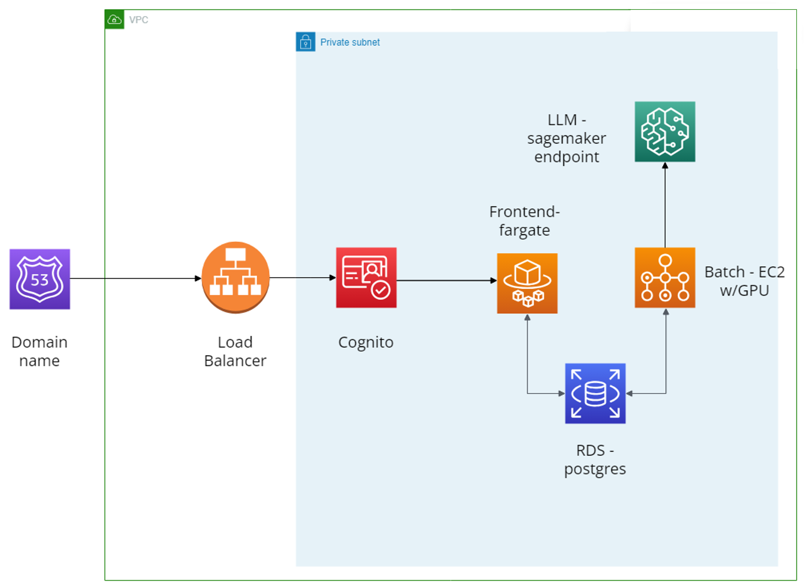

# Infrastructure FAQs

## Architecture

### Resources and status
* **RDS Postgres DB** - fully integrated
  * Credentials can be found in Secrets Manager (when `ai-engineer-role` or `developer` is assumed). Navigate to this by searching for secrets manager in the console or using the aws cli commands for the relevant secrets
* **Sagemaker** - `ready to integrated`
  * Endpoint needs to be spun up when read to be integrated into the app. Ask an engineer to help you do this (Elliot Moore)
  * Work is ongoing to spin these up and down as and when they are being used to  save costs. In the interim, if testing, please ensure that you delete endpoints post use. You can use the boto docs to find the relevant bits for this.
* **Cognito** - `fully integrated`
  * Users can be added to cognito in this repo (here)[https://github.com/i-dot-ai/consultation-analyser-infra-config]
  * Add users to the appropriate environment `.tfvars`
  * The next time you release your app credentials will be sent out
* **Batch** - `ready to integrated`
  * Place holder code provided on how to use batch in this (PR)[https://github.com/i-dot-ai/consultation-analyser/pull/48/files]. Submit job function documentation is also available in boto documentation. Unit tests available for this code as well.
* **GitHub Actions** - `fully integrated`
  * Actions for building and pushing docker images and deploying to ECS
  • Actions for building and pushing docker images to AWS batch.
  * Actions for deploying changes to consultations infrastructure available as well.

## How to deploy the consultations app to AWS
1. **Build and push the docker image**
   1. Push code to the repo on any branch to trigger a build workflow to run
   2. This will build the docker image and then push that to ECR

2. **Once the workflow is complete it is ready to be released. PLEASE ENSURE THAT THE BUILD WORKFLOW HAS SUCCEEDED BEFORE THIS NEXT STEP.**

3. **To deploy the app to a test environment run: `make release env=<ENV>`**
   1. You will only be able to deploy to `dev` or `preprod` through this make command
   2. This will deploy the image from ECR to the ECS cluster. This will also deploy changes to batch.

4. **See the changes live**
   1. Once the workflows finishes it will take some time to for ECS to swap out the images
   2. When completed you will be able to see the changes at:
      1. dev: consultations-dev.ai.cabinetoffice.gov.uk
      2. preprod: consultations-preprod.ai.cabinetoffice.gov.uk

5. **To release to `prod`**
   1. Create a PR to main
   2. Once approved and merged, this will trigger both a build action.  Please ensure that any terraform changes are PR'd carefully before merging into main, this will affect production deployments.
   3. When the build has successfully finished it will automatically trigger a release to `prod` to update ECS
      1. prod: consultations.ai.cabinetoffice.gov.uk

## Passing environment variables into ECS - how to give your docker runtime environment variables.
1. This is done through `./infrastructure/ecs.tf` in `environment_variables`
2. If this is a secret, add the secret to Secrets Manager and tag it with the key `SecretPurpose` and the value of `general`
3. Replicate the pattern used with the `django_secret` in `./infrastructure/secrets.tf`
4. And pass in the secretsmanager secret_string into the environment variables like `DJANGO_SECRET_KEY`
   1. **Do not hardcode any secrets into these variables**

## FAQ Debugs
1. **The build and release workflows have finished without failing, but now the service is down.**
   1. The code in the docker image is likely broken
   2. To see the logs of the container, login to the aws console and switch roles to the `ai-engineer-role`. More detailed instructions (here)[https://github.com/i-dot-ai/i-ai-core-infrastructure/wiki/Using-AWS-Vault#switching-roles-in-the-console]
   3. To see the logs of the container:
      1. go to Elastic Container Service
      2. Navigate to the `i-dot-ai-default-<ENV>-ecs-cluster` cluster
      3. Under services click on `i-dot-ai-consultations-<ENV>-ecs-service`
      4. Logs

2. **My release action failed at the `Terraform apply` stage**
   1. Double check that build step has successfully passed
   2. Outputs of this stage are hidden as could contain sensitive information. Please ask someone from the engineering to help you debug this step.

3. **I am hitting some permission errors**
   1. This can be amended, please speak to a Cloud engineer to advise.

4. **If you'd like to connect to the hosted docker container to run bash commands in the container shell**, you can do so by following this article: . In summary, you'll need:
   1. To install aws session-manager plugin
   2. To ensure that your ecs service has the ecs_exec variable set to True.
   3. If you're trying this for the first time, here's a massively useful tool:  https://github.com/aws-containers/amazon-ecs-exec-checker
   4. Run this command `aws ecs execute-command --cluster <cluster-name> --task <task-id> --container <container-name> --interactive --command "/bin/sh"
    `

